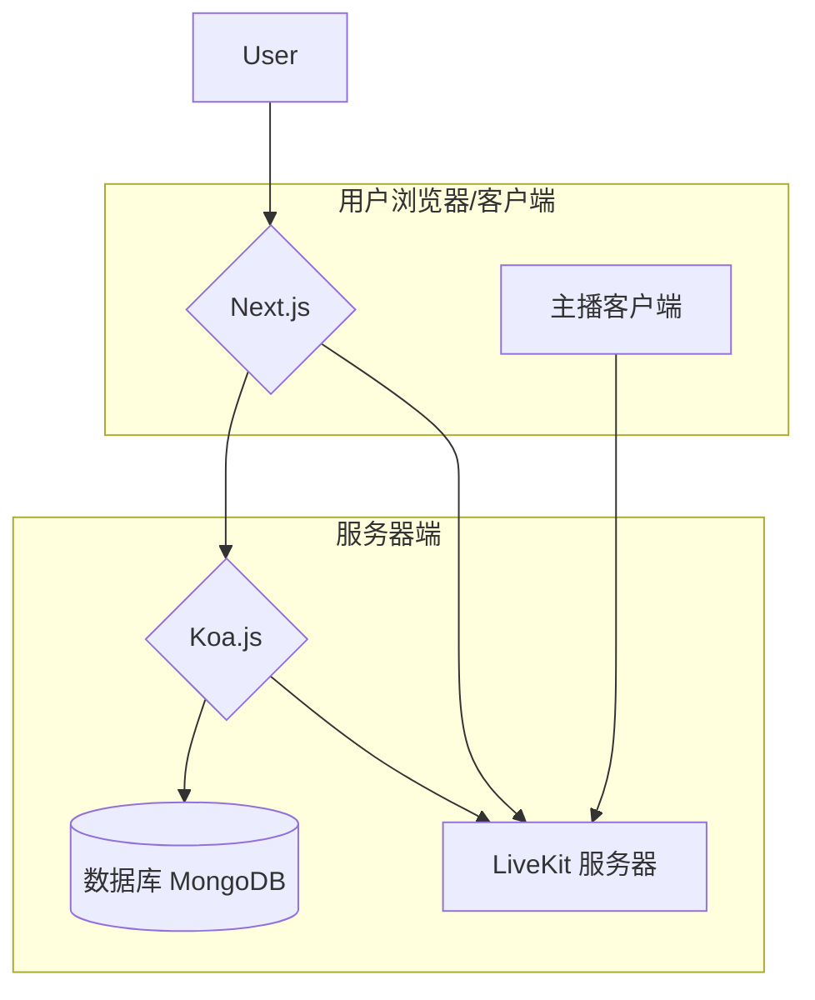
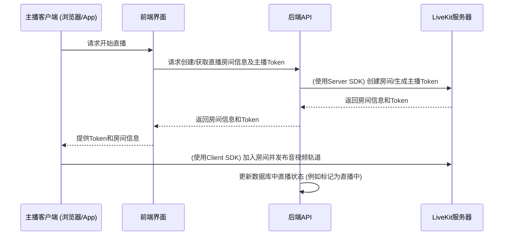
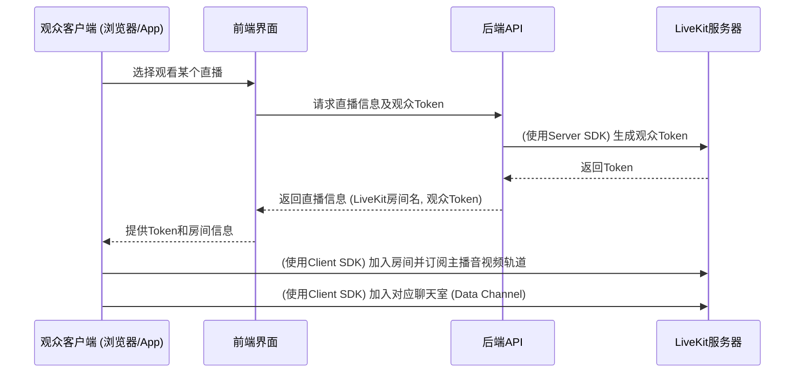

# 仿Twitch直播平台

这是一个包含前端 (Next.js) 和后端 (Koa.js) 的仿 Twitch 直播平台项目，利用 LiveKit 实现基于 WebRTC 的实时视频直播和互动体验。

## ✨ 技术栈 (Tech Stack)

### 前端 (Frontend)
*   **框架**: Next.js (~15.2.3)
*   **语言**: TypeScript
*   **UI**: React (~19.0.0), Tailwind CSS (~4.0.15), Shadcn/ui (Radix UI + Lucide Icons), Sonner (通知)
*   **实时通讯**: LiveKit Client SDK
*   **状态管理/数据获取**: React Context API, Axios
*   **动画**: Framer Motion
*   **图表**: Echarts

### 后端 (Backend)
*   **框架**: Koa.js (~2.16.0)
*   **语言**: TypeScript
*   **数据库**: MongoDB (使用 Mongoose)
*   **API 与路由**: koa-router
*   **认证**: JWT, bcrypt
*   **实时通讯**: LiveKit Server SDK

### 媒体服务器 (Media Server)
*   **LiveKit**: 用于 WebRTC 低延迟互动直播、聊天及媒体流处理。

## 🚀 核心功能 (Core Features)

*   **用户认证**: 用户注册、登录、登出、用户资料管理。
*   **直播浏览**:
    *   按分类浏览直播。
    *   查看推荐频道。
    *   搜索频道/直播。
*   **直播观看**:
    *   实时视频播放 (通过 LiveKit 的 WebRTC)。
    *   实时聊天/弹幕 (通过 LiveKit Data Channels)。
*   **主播功能**:
    *   创建和管理自己的直播频道。
    *   开始/结束直播 (通过 LiveKit SDK 控制房间和媒体轨道)。
    *   设置直播标题、分类、标签。
    *   与观众互动 (通过 LiveKit 聊天)。
*   **内容管理**:
    *   分类管理。
    *   标签管理。
    *   首页横幅管理。
*   **管理员功能**:
    *   用户管理。

## 📊 系统架构与数据流 (System Architecture & Data Flow)

### 组件交互图


### 主播开播流程 (Simplified)


### 观众观看直播流程 (Simplified)


## 🛠️ 开发环境设置 (Development Setup)

### 1. 依赖安装
分别进入 `front` 和 `backend` 目录，运行 `pnpm install` 来安装各自的依赖。

```bash
# 安装前端依赖
cd front
pnpm install

# 安装后端依赖
cd ../backend
pnpm install
cd ..
```

### 2. 配置后端环境变量
进入 `backend` 目录，复制 `.env.example` 文件为 `.env`：
```bash
cd backend
cp .env.example .env
```
然后编辑 `.env` 文件，至少需要配置以下项：
*   `MONGO_URI`: 你的 MongoDB 连接字符串。
*   `LIVEKIT_URL`: 你的 LiveKit 服务器 WebSocket 地址 (例如 `wss://your-livekit-instance.livekit.cloud`)。
*   `LIVEKIT_API_KEY`: 你的 LiveKit API Key。
*   `LIVEKIT_API_SECRET`: 你的 LiveKit API Secret。
*   `JWT_SECRET`: 用于生成和验证 JWT 的密钥。

示例 `.env` 内容:
```env
PORT=5000
MONGO_URI=mongodb://localhost:27017/twitch_clone
JWT_SECRET=your_very_secret_jwt_key
CORS_ORIGIN=http://localhost:3000

LIVEKIT_URL=wss://your-livekit-instance.livekit.cloud
LIVEKIT_API_KEY=your_livekit_api_key
LIVEKIT_API_SECRET=your_livekit_api_secret
```

### 3. 运行后端
```bash
cd backend
pnpm dev
```
后端服务将在 `http://localhost:5000` (或你在 `.env` 中配置的 `PORT`) 启动。

### 4. 运行前端
```bash
cd front
pnpm dev
```
前端服务将在 `http://localhost:3000` 启动。

**注意**: 你需要一个正在运行的 LiveKit 服务器实例。你可以使用 LiveKit Cloud (livekit.io) 或自行部署一个 LiveKit 服务器。确保 `.env` 文件中的 `LIVEKIT_URL`, `LIVEKIT_API_KEY`, 和 `LIVEKIT_API_SECRET` 配置正确。

## 🚀 部署说明 (Deployment)

部署此项目涉及前端应用、后端 API 和 LiveKit 服务器的部署。

### 后端 API
1.  确保生产环境服务器已安装 Node.js 和 pnpm。
2.  将 `backend` 目录代码部署到服务器。
3.  创建并配置生产环境的 `.env` 文件，包含所有必要的密钥和数据库连接信息，特别是：
    *   `MONGO_URI` (连接到生产数据库)
    *   `JWT_SECRET` (使用强密钥)
    *   `LIVEKIT_URL` (指向你的生产 LiveKit 服务器实例)
    *   `LIVEKIT_API_KEY`
    *   `LIVEKIT_API_SECRET`
    *   `CORS_ORIGIN` (设置为你的前端生产域名)
4.  安装依赖: `pnpm install --prod`
5.  构建项目: `pnpm build`
6.  启动服务 (推荐使用进程管理器如 PM2): `pm2 start dist/index.js --name twitch-clone-backend`

### 前端应用
1.  确保生产环境服务器已安装 Node.js 和 pnpm (或使用静态托管服务)。
2.  将 `front` 目录代码部署到服务器。
3.  配置环境变量 (通常通过托管平台的环境变量设置，或在构建时注入):
    *   `NEXT_PUBLIC_API_BASE_URL`: 指向你的后端 API 生产地址 (例如 `https://api.yourdomain.com`)。
    *   `NEXT_PUBLIC_LIVEKIT_URL`: (可选，如果前端需要直接知道 LiveKit URL，但通常后端会通过token接口提供必要信息)。
4.  安装依赖: `pnpm install --prod`
5.  构建项目: `pnpm build`
6.  启动服务 (如果使用 Node.js 服务器): `pnpm start` (或使用 PM2)。对于 Vercel/Netlify 等平台，它们会自动处理构建和启动。

### LiveKit 服务器
*   **LiveKit Cloud**: 最简单的方式是使用 [LiveKit Cloud](https://livekit.io/)。
*   **自部署**: 你也可以根据 [LiveKit 官方文档](https://docs.livekit.io/oss/deployment/) 自行部署 LiveKit 服务器。确保其网络可访问性，并正确配置 API Key 和 Secret。

## 📄 API 文档 (API Documentation)

项目包含一个 API 文档文件位于 [`docs/api.md`](docs/api.md:0)。
**请注意**: 此文档可能不是最新的。建议直接查阅后端代码中的路由定义 ([`backend/src/routes/`](backend/src/routes/:0)) 以获取最准确的 API 信息。

## 🤝 贡献指南 (Contributing)

欢迎对此项目做出贡献！请遵循以下步骤：
1. Fork 本仓库。
2. 创建你的特性分支 (`git checkout -b feature/AmazingFeature`)。
3. 提交你的更改 (`git commit -m 'Add some AmazingFeature'`)。
4. 推送到分支 (`git push origin feature/AmazingFeature`)。
5. 打开一个 Pull Request。

## 📜 许可证 (License)

本项目采用 ISC 许可证。详情请见 `LICENSE` 文件 (如果存在)。
