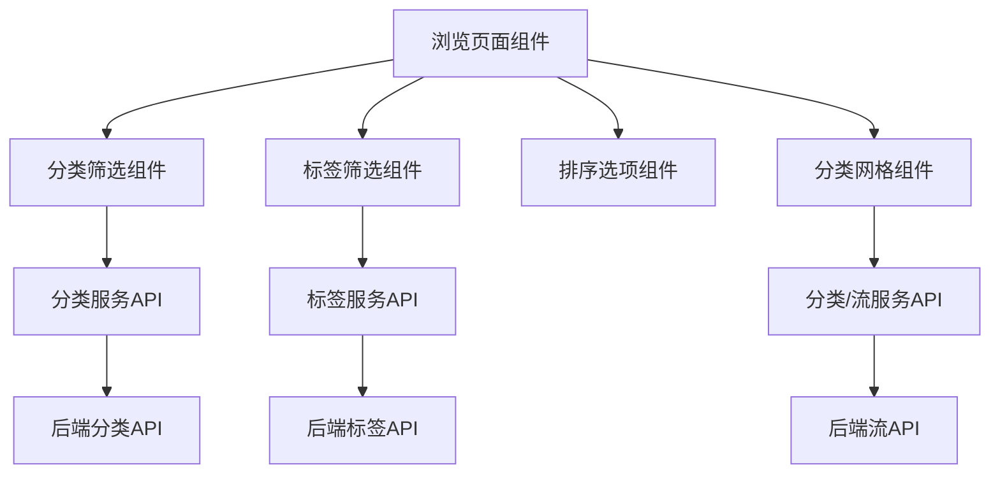

# 浏览模块组件

本模块包含浏览页面所需的组件，实现直播分类浏览功能。

## 组件概览

1. `CategoryFilter`: 分类筛选组件，显示分类导航栏
2. `TagFilter`: 标签筛选组件，展示和选择标签
3. `SortOptions`: 排序选项组件，控制直播排序方式
4. `CategoryGrid`: 分类网格组件，展示直播分类卡片

## 主要功能

- 分类筛选: 通过分类导航栏筛选不同分类的直播内容
- 标签筛选: 通过选择标签进一步筛选内容
- 排序功能: 支持按观看人数、最新开播和热度上升排序
- 内容展示: 以卡片网格形式展示分类内容，包括封面图、名称和观看人数

## 实现细节

- 使用React状态管理筛选和排序条件
- 通过API服务层与后端交互，获取所需数据
- 支持加载状态展示和错误处理
- 实现空状态展示，当无内容时显示提示信息

## 数据流向

```
用户交互 -> 状态更新 -> API请求 -> 数据展示
```

## 后端API依赖

- `/api/categories` - 获取所有分类
- `/api/categories/popular` - 获取热门分类
- `/api/tags` - 获取标签列表
- `/api/streams` - 获取筛选后的直播列表

## 使用示例

```tsx
<CategoryFilter 
  selectedCategory={selectedCategory} 
  onSelectCategory={handleCategoryChange}
/>

<TagFilter 
  selectedTags={selectedTags} 
  onToggleTag={handleTagToggle}
/>

<SortOptions 
  sortBy={sortBy} 
  onSortChange={handleSortChange} 
/>

<CategoryGrid 
  selectedCategory={selectedCategory} 
  selectedTags={selectedTags} 
  sortBy={sortBy}
/>
```

## 开发总结

### 已完成功能
- ✅ 分类导航组件，支持选择不同分类
- ✅ 标签筛选组件，支持多选标签
- ✅ 排序选项组件，支持多种排序方式
- ✅ 分类展示网格，包括加载状态和空状态处理

### 后续改进
- 添加分页或无限滚动功能
- 优化移动端适配
- 实现标签数据缓存
- 添加用户浏览历史记录

## 技术架构


