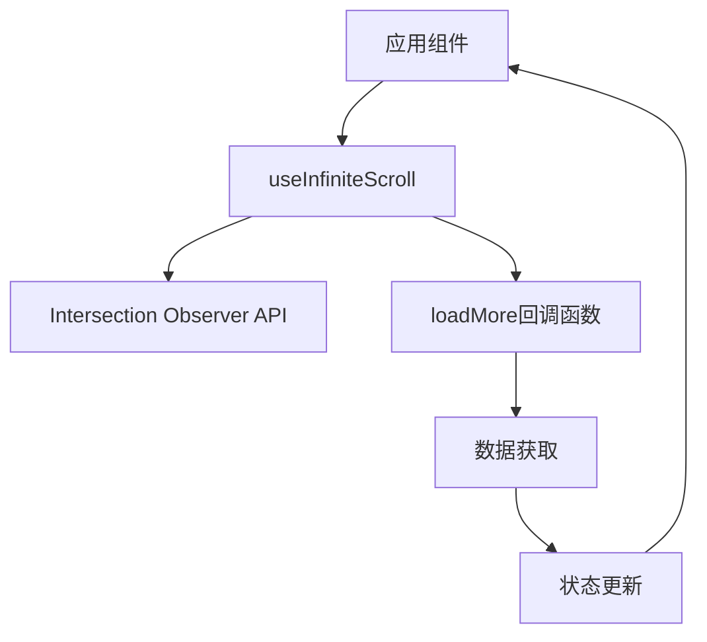

# 钩子（Hooks）

本目录包含应用中使用的自定义 React 钩子。

## useInfiniteScroll

无限滚动钩子，用于实现列表的自动加载更多功能。

### 用法

```tsx
const { observerRef } = useInfiniteScroll(loadMore, {
  hasMore: true,    // 是否还有更多数据
  isLoading: false, // 是否正在加载
  threshold: 300    // 距离底部多少像素时触发加载（可选，默认300）
});

// 在组件中使用
return (
  <div>
    {/* 列表内容 */}
    <div ref={observerRef}>
      {isLoading && <div>加载中...</div>}
    </div>
  </div>
);
```

### 特性

- 使用 Intersection Observer API 检测元素是否进入视口
- 自动处理加载状态，避免重复加载
- 可配置距离底部的触发阈值
- 支持条件加载（只有当hasMore为true时才会触发）

### 实现细节

- 当观察元素进入视口时，如果有更多数据且不在加载状态，则触发加载更多回调
- 通过useEffect自动清理Observer，避免内存泄漏
- 使用useCallback确保回调函数引用稳定

## 技术架构


